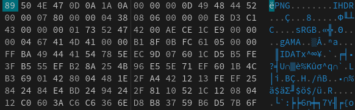
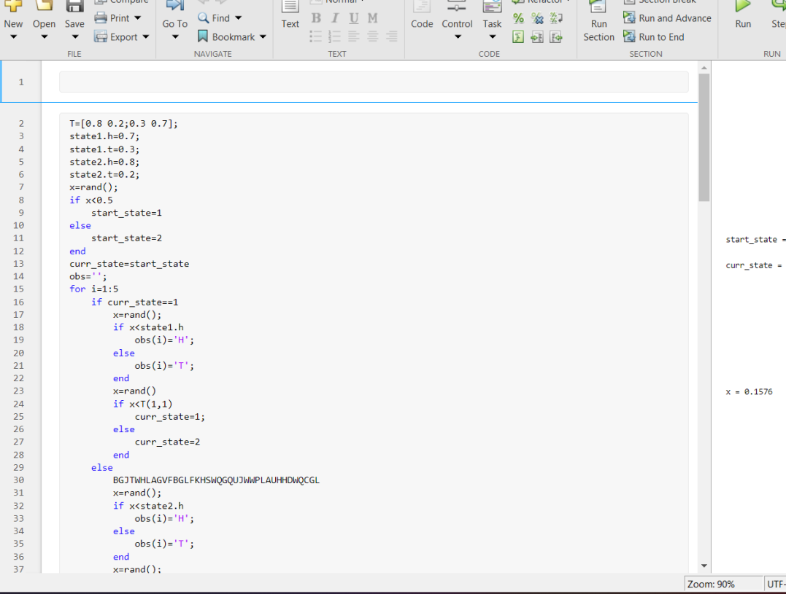

# G

download the zip file
inside there will be screenshot(722).png
when trying to open it it shows error
when you use **ghex** on the image u get this:

as u can see there are quita a few errors so lets fix those
-change the **PnG** to **PNG**
-change the **IHdR** to **IHDR**
-change the **IDaT** to **IDAT**

now when u try opening the image

hmm that means we missed something,looking through it its an **IDAT** chunk
after fixing it when we open it we get this image

hmm ==BGJTWHLAGVFBGLFKHSWQGQUJWWPLAUHHDWQCGL== is sus
put it in a a cipher identifier
[chipher identifier](https://www.dcode.fr/cipher-identifier)
it seems its a **Fractionated Morse Cipher**
decrypt it and we get:
**FLAGGHEXFRAKSTONATEDMORSEENCODER**
so our flag is:
FLAG{GHEXFRAKSTONATEDMORSEENCODER}
