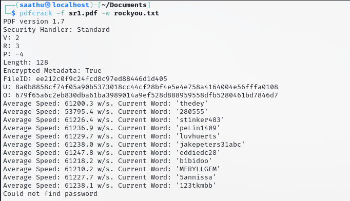
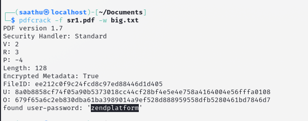

# zip
hmm looks like **sankjnkjda-protected.pdf** is protected, lets look at the image for now

here there is **rockyou.txt** and **big.txt** password cracking dictionaries

lets first try it with rockyou.txt

looks like it didnt work.
lets try it with **big.txt**

yes! looks like the password is **zendplatform**

opening the pdf with this password we get a blank page

after clicking around randomly for sometime this happened

the flag is:**Flag{CipherMaster_1337}**

